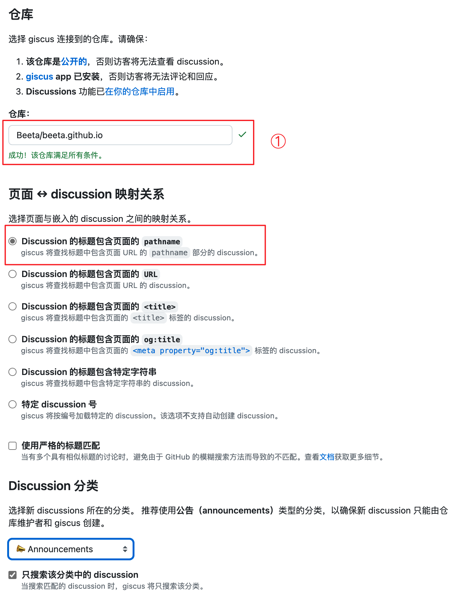

## 背景

调研了很多静态博客的评论系统：

-   [utterances](https://www.yuanmoc.cn/posts/使用hugo搭建博客/ "utterances")
-   [Giscus](https://giscus.app/zh-CN "Giscus")([**教程**](https://www.lixueduan.com/posts/blog/02-add-giscus-comment/ "教程"))，继承自utterances
-   [https://twikoo.js.org/](https://twikoo.js.org/ "https://twikoo.js.org/") 评论系统([教程](https://www.sulvblog.cn/posts/blog/hugo_twikoo/ "教程"))
-   [Gittalk](https://github.com/gitalk/gitalk/blob/master/readme-cn.md "Gittalk")：利用issue直接作为博文
-   [waline](https://waline.js.org/guide/get-started/ "waline")

已经装完了utterances，在整理资料的时候发现giscus好像更好：有中文+能回复，所以临时改成了giscus

## 前置准备

1.  确定仓库：一般选择博客本身即可，比如这里我的 Beeta/beeta.github.io，要确保是公开的
2.  安装[giscus](https://github.com/apps/giscus "giscus")(选择上面的仓库)
3.  启用[Discussions](https://docs.github.com/en/github/administering-a-repository/managing-repository-settings/enabling-or-disabling-github-discussions-for-a-repository "Discussions")功能

    

## 获取giscus配置

完成上述准备工作后就可以访问 [giscus 官网](https://giscus.app/zh-CN "giscus 官网") 获取配置信息了

关注点：

-   仓库要写前面明确的仓库
-   页面和discussion的映射关系一般用第一个
-   分类选Announcements，因为这个类型的discussion只有管理员才有权限操作

做完上面的操作后，会在下面生成一个script配置文件：

## 配置到博客系统

复制上面的script代码段。添加到当前使用主题目录文件nw对应的位置。

我用的Papermod，路径在：`themes/PaperMod/layouts/partials/comments.html`

提交代码，就可以在博文最下面看到评论框了。

