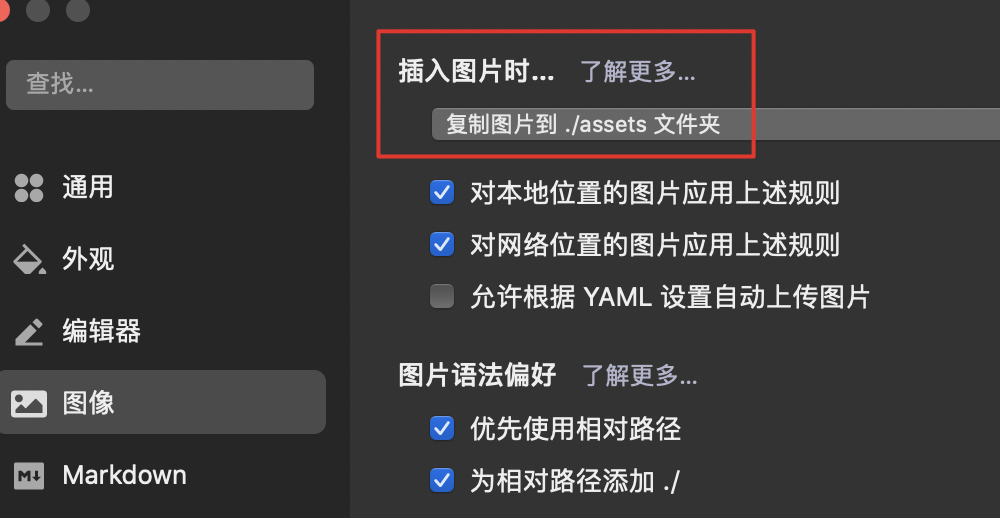

之前在平台上写博文，写完发布拉倒。现在自己建站，虽然自由了些，但牵扯到hugo、github提交和发布，麻烦了点，现在把流程规范和记录下来。

## 1. 创建博文目录

```bash
goblog # alias命令，cd到博客所在的git仓库
# 新建博文markdown
# 规范：在posts/年份/博文标题目录/index.md
# 年份是便于分类，博文标题做目录是为了让图片和md文件在一块，标题用英文，在url上好看些，md文档的front matter 的title字段可定义中文标题
hugo new posts/2023/博文标题/index.md
```

## 2. 使用 typora 编辑md文件

1. 打开文件：`open -a typora index.md`
2. 编辑front matter，
   - 注意编辑标题、分类、tag等，
   - draft改为false，
   - slug是博文url的最后字段，如果为空默认就用当前目录，slug会默认做转换：将所有字母转换为小写字母，「-」替换空格，删除所有特殊字符


另外，还要在typora中设置「图片复制到`./assets`文件夹」



## 3. 本地预览

写完后，可用以下命令预览，其中 -D 是显示草稿文章。

```bash
hugo server -D
```

## 4. 提交到github

```bash
# 一般情况下
git add -A
git cm -m "添加博文xx"
git push origin master # 可能需要代理
```

提交后，会激活[github action](https://github.com/Beeta/beeta.github.io/actions)自动发布，稍后即可在 [tubaozi.top](http://tubaozi.top/) 看到了。

## 5. 备份

将md文件导入到 `wolai: -> Life/个人博客tubaozi.top/博文备份` 下
