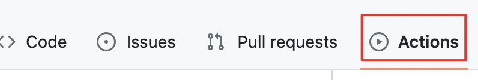

一直想着建个自己的网站，顺便折腾点主题。前几天突发奇想注册了这个[域名](tubaozi.top)。顺手也把网站搭起来。调研了现在静态博客的情况，之前印象中的流行框架 HEXO 已然被 Hugo 盖住了风头。学习了下 Hugo，够简单，功能也够丰富。虽然网上 Hugo 搭建指南一大把，但我还是记录一下自己的使用过程，也作为第一篇正式博文。


你可以在这篇博客中了解到：

- Hugo 搭建静态博客方法
- 利用 github pages 托管网页
- 利用 github action 自动发布网页
- 一些建站过程中的 tips

## 安装Hugo

Hugo的官网是[https://gohugo.io/](https://gohugo.io/)，另外有个中文文档网站[https://gohugo.org/](https://gohugo.org/)也可以参考。


官方推荐了很多[安装方式](https://gohugo.io/installation/)，但我觉得直接下载[二进制文件](https://github.com/gohugoio/hugo/releases/tag/v0.113.0)最为方便(升级需要手动)，Hugo有标准版、扩展版两个版本，扩展版支持对 WebP 图像进行编码和使用嵌入式 LibSass 转译器将 Sass 转译到 CSS，官方也推荐使用扩展版。


下载后，放到对应路径，添加到 PATH 环境变量，更方便使用。安装完后，使用以下命令进行验证：

```bash
hugo version
```

## 使用Hugo

### 生成站点

即在指定路径下生成名为 sitename 的文件夹

```bash
hugo new site /path/to/sitename
```

站点目录结构：

```
  ▸ archetypes/
  ▸ content/
  ▸ layouts/
  ▸ static/
    config.toml
```

### 创建文章

在content文件夹下新建`posts`文件夹并新建`xx.md`文档

```bash
hugo new posts/xx.md
```

默认生成的 xx.md 内容和解释如下：

```md
title: "xx" # 网站显示的文章名字，可以与文件名不同
date: 2021-08-19T15:04:55+08:00
draft: true # 是否为草稿

# 下面两个默认没有，需要自己加
categories: ["互联网"] # 文章分类
tags: ["Hugo", "Github Pages", "Github Actions", "CI/CD"] # 文章标签
```

一般情况下，我们都要新建这些文件构建网站的骨架：

- about.md 
- archives.md
- search.md
- category.md 


我一般会用文件夹组织 content 内的博文，比如我在`posts`下新建年份目录(2023/)进行归类，便于查找管理

### 使用主题

可以去[这里](https://themes.gohugo.io/)下载相关主题，并解压到`theme`目录下。我个人比较喜欢 PaperMod 主题，然后参考[Cassius's Blog](https://www.yuweihung.com/)进行了魔改。除了下载也可以 git clone，或者 git submodule 便于更新主题。


使用主题需要在`hugo.toml`中添加`theme: PaperMod`才能启用

### 运行Hugo

在你的站点根目录执行 `Hugo` 命令进行调试：

```
hugo server -D --theme=PaperMod
```

-D 是显示草稿文章，--theme 是自行指定主题。然后打开 localhost:1313 就能欣赏自己的网站了。


如果没问题，可以执行发布命令，发布正式网站内容到`public`目录：

```bash
hugo
```

### hugo.yml 展示

`hugo.yml`做了很多配置，我的如下：

```yml
baseURL: "http://tubaozi.top/"
title: 今是昨非 | 技术.生活.阅读.思考
paginate: 10
theme: PaperMod
languageCode: zh
defaultContentLanguage: zh

enableInlineShortcodes: true
enableRobotsTXT: true
buildDrafts: false
buildFuture: true
buildExpired: false
enableEmoji: true
googleAnalytics: G-MZJS5SGFET

minify:
  disableXML: true
  minifyOutput: true

menu:
  main:
    - name: 🔎 搜索
      url: search/
      weight: 9
    - name: ⏱️ 时间轴
      url: archives
      weight: 10
    - name: ⛩️ 分类
      url: categories/
      weight: 20
    - name: 🧩 标签
      url: tags/
      weight: 30
    - name: 🙋🏻‍♂️ 关于
      url: about
      weight: 50

outputs:
  home:
    - HTML
    - RSS
    - JSON

params:
  env: production # to enable google analytics, opengraph, twitter-cards and schema.
  description: "个人博客"
  author: Beeta
  # author: ["Me", "You"] # multiple authors
  # images: /favicon.ico

  defaultTheme: auto
  disableThemeToggle: false
  # ShowShareButtons: true
  # ShowReadingTime: true
  # disableSpecial1stPost: true
  displayFullLangName: true
  ShowPostNavLinks: true
  ShowBreadCrumbs: false
  ShowCodeCopyButtons: true
  ShowToc: true

  # home-info mode
  homeInfoParams:
    Title: "悟已往之不谏，知来者之可追"
    Content: >
      - ✨ 欢迎来到我的个人博客

      - 🤔 我在这里分享技术、读书、生活还有思考。
  socialIcons:
    - name: Github
      url: "https://github.com/Beeta"
    - name: RSS
      url: "index.xml"
    - name: email
      url: "mailto:zrc199021@163.com"

  label: # 左上角图标
    text: "今是昨非"
    icon: "img/足迹.png"
    iconHeight: 35

markup:
  goldmark:
    renderer:
      unsafe: true
```

## 配置github actions

一般情况下，直接把`public`目录内容提交到你的`xx.github.io`仓库就能访问了。但这样做需要每次都提交一堆内容，比较繁琐。我们可以用 github actions 实现**提交自己的 md 文档后自动执行发布**的功能。


原理：发布博文到仓库 -> 触发 actions 执行`hugo`命令并复制`public`下内容到指定仓库。


有的人将博文和发布内容放到两个仓库，我则是发到了统一仓库的两个分支上：master 分支存md 文件，gh-pages 分支放发布后的内容。


github actions 配置如下：

点击 github 仓库页面`Actions`进行操作

最终会在仓库下生成`.github/workflows`目录内部有自己指定的配置文件，如`github-pages.yaml`。其中`secrets.G_T`是自己申请的(settings->Actions secrets and variables->Actions创建名为secrets.G_T的秘钥)


`github-pages.yaml`内容如下

```yaml
name: GitHub Pages

on:
  push:
    branches:
      - master  # Set a branch to deploy
  pull_request:

jobs:
  deploy:
    runs-on: ubuntu-20.04
    concurrency:
      group: ${{ github.workflow }}-${{ github.ref }}
    steps:
      - uses: actions/checkout@v3
        with:
          submodules: true  # Fetch Hugo themes (true OR recursive)
          fetch-depth: 0    # Fetch all history for .GitInfo and .Lastmod

      - name: Setup Hugo
        uses: peaceiris/actions-hugo@v2
        with:
          hugo-version: '0.112.1'
          extended: true

      - name: Build
        run: hugo --minify

      - name: Deploy
        uses: peaceiris/actions-gh-pages@v3
        if: ${{ github.ref == 'refs/heads/master' }}
        with:
          github_token: ${{ secrets.G_T }}
          publish_dir: ./public
```

## tips

- `hugo.toml`是最近版本新改的，之前是`config.yml`，两者都行，甚至`hugo.yml`也行。我比较习惯yaml语法，所以用最后这个
- 每次发布都会重刷 public 里的所有文件，所以一些需要保留的文件需要放到static目录下
- 可以在static下放 favicon.ico 文件，再网页标题栏显示图标
- 博客图片也可以放到 static 下，但是我个人习惯 md 文件和图片在同目录下。所以我的方式是每个博文一个文件夹，下面新建`index.md`作为博文主体。文件夹最好是英文，这样 url 编码好看些。
- 生成的文章内部头部配置信息包括一些文章名称，时间之类的信息，可以事先在目录 archetypes/default.md 下使用模板，这样在用命令 hugo new 生成文章后会自动加上模板里的配置
- 我的博客代码托管在：https://github.com/Beeta/beeta.github.io

## 参考

下面的博客给了我很大帮助:

- https://www.yuweihung.com/
- https://www.sulvblog.cn/
  - [hugo博客搭建 | PaperMod主题](https://www.sulvblog.cn/posts/blog/build_hugo/)
- [使用 Hugo+Github Actions 实现自动化部署博客](https://blog.mlosun.com/posts/beeeabdb/)
- [使用 Hugo 从 0 到 1 搭建个人博客](https://elizen.me/posts/2021/01/hugo-form-0-to-1/)
