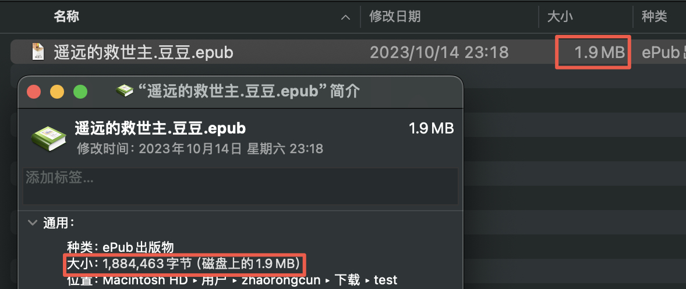
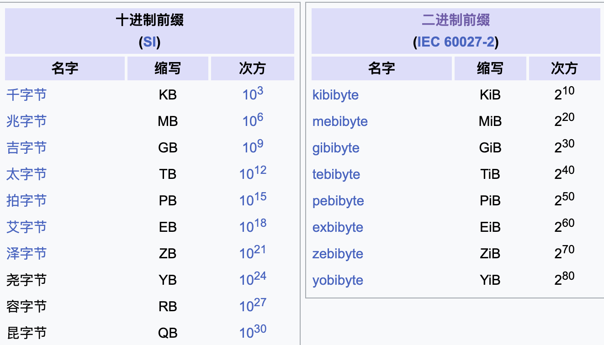
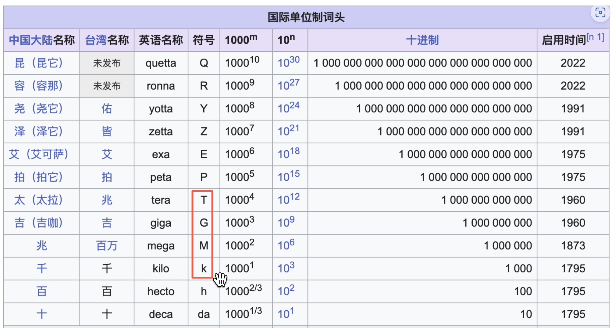

## 一个例子



Mac中的一个文件，显示大小为：1884463字节，显示MB大小位1.9。

但是，1884463/1024/1024 = 1.797…，这是什么原因呢？

**我们再使用**`du`**来查看这个文件**：


又不一样了，这是为什么呢？使用 man du 可以看到如下说明


## 两个标准：IEC和SI

IEC：国际电工委员会。1999年1月，[国际电工委员会](https://zh.wikipedia.org/wiki/国际电工委员会)（IEC）引入了“kibi-”、“mebi-”、“gibi-”等词头以及缩写符号“Ki”、“Mi”、“Gi”等来明确说明二进制乘数计数。

SI：International System of Units，国际单位制，也就是：



也就是说：

```plain
1GB = 10^3 MB = 10^6 KB = 10^9 B   # 优盘，磁盘厂家常用
1GiB = 2^10 MiB = 2^20 KiB = 2^30 B
```

而我们平常中的  GB/MB/KB等的1024转换实际上是以讹传讹就这么用下来了。

## 两个领域：计算机和通信

上面说的GB/MB实际都属于`计算机领域`，

而我们常用的**比特率bps**则属于`通信领域`，在通信领域，一般遵守SI规范，即换算为1000，如：

```plain
1Gbps = 10^3 Mbps = 10^6 kbps = 10^9 bps
```

> 请再次注意上面的大小写。这也是SI 的标准



## 总结一下

1. 计算机领域一般以2^10为进制，通信领域一般以10^3为进制，通信领域一般遵守SI标准
2. 1GB=1024MB其实是错的，准确的是 1Gib=1024MiB
3. 在电信领域，没有`g，m，K`，只有`G，M，k` (学术上)
4. 1Mbps = 1000kbps

## 参考

https://zh.wikipedia.org/wiki/国际单位制词头
