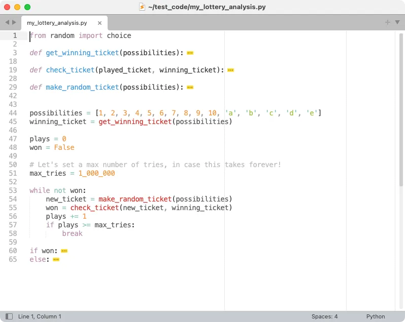

# 如何高效地阅读 Python 代码？

**副标题：一个重要但很少被讨论的技能**

> 从网上看到这篇英文文章，感觉还不错，翻译了一下。Claude2 也有参与翻译😝

## AI摘要

这篇文章讨论了阅读代码的重要性以及一些高效阅读代码的策略。作者指出，阅读代码需要不同于编写代码的技能，并且认为相信自己可以轻松地阅读发布的解决方案是一个常见的误解。文章提供了一个练习的代码库，并展示了一些阅读代码的策略，**如忽略函数定义和简化重复的代码块。作者还强调了使用IDE（集成开发环境）来帮助快速识别和关注代码的重要性**。最后，文章提到了编写可读的代码以及学习阅读其他人的代码和第三方库的重要性。

## 正文

阅读代码是一项重要的技能，但却不常被讨论。我认为存在这样的假设：如果你学会了相当好地编写代码，你也会自动学会有效地阅读代码。但是阅读代码需要不同于编写代码的技能，所以我不认为这是一个安全的假设。

一位读者最近询问《Python Crash Course》中练习的一个解决方案。他说他的解决方案比我发布的简单许多，并说他们很难阅读发布的解决方案。我认为这是一个很好的例子，说明有效代码阅读的策略根本不明显。在这篇文章中，我将展示我们讨论的代码，以及一些比从头到尾逐行阅读更有效的处理代码的策略。

## 练习内容

我们讨论的练习分两个部分。第一部分是:

**彩票**

```text
制作一个包含10个数字和5个字母的列表或元组。从中随机选择4个数字或字母,打印出匹配这4个数字或字母的任意一注彩票可获奖。
```

这个练习旨在让人们练习使用Python标准库中的代码，比如 random.choice()函数。

下面是后续练习:

**彩票分析**

```text
你可以用一个循环来模拟刚刚建立的彩票游戏有多难中奖。建一个名为 my_ticket 的列表或元组。编写一个循环获取数字，直到抽中的彩票获奖为止，循环结束后打印循环了多少次才得到中奖的彩票。
```

在读者已经开始学习序列、循环、函数和类的时候，给他们布置这样一个既具体又开放的练习是很有意思的。对这样的练习任务制定解决方案，可以应用你所学的知识。

## 发布的解决方案

如果你不习惯阅读代码，发布的解决方案会觉得有点长，但我全部贴出来：

```python
from random import choice

def get_winning_ticket(possibilities):
    """Return a winning ticket from a set of possibilities."""
    winning_ticket = []

    # We don't want to repeat winning numbers or letters, so we'll use a
    #   while loop.
    while len(winning_ticket) < 4:
        pulled_item = choice(possibilities)

        # Only add the pulled item to the winning ticket if it hasn't
        #   already been pulled.
        if pulled_item not in winning_ticket:
            winning_ticket.append(pulled_item)

    return winning_ticket

def check_ticket(played_ticket, winning_ticket):
    # Check all elements in the played ticket. If any are not in the 
    #   winning ticket, return False.
    for element in played_ticket:
        if element not in winning_ticket:
            return False

    # We must have a winning ticket!
    return True

def make_random_ticket(possibilities):
    """Return a random ticket from a set of possibilities."""
    ticket = []
    # We don't want to repeat numbers or letters, so we'll use a while loop.
    while len(ticket) < 4:
        pulled_item = choice(possibilities)

        # Only add the pulled item to the ticket if it hasn't already
        #   been pulled.
        if pulled_item not in ticket:
            ticket.append(pulled_item)

    return ticket

possibilities = [1, 2, 3, 4, 5, 6, 7, 8, 9, 10, 'a', 'b', 'c', 'd', 'e']
winning_ticket = get_winning_ticket(possibilities)

plays = 0
won = False

# Let's set a max number of tries, in case this takes forever!
max_tries = 1_000_000

while not won:
    new_ticket = make_random_ticket(possibilities)
    won = check_ticket(new_ticket, winning_ticket)
    plays += 1
    if plays >= max_tries:
        break

if won:
    print("We have a winning ticket!")
    print(f"Your ticket: {new_ticket}")
    print(f"Winning ticket: {winning_ticket}")
    print(f"It only took {plays} tries to win!")
else:
    print(f"Tried {plays} times, without pulling a winner. :(")
    print(f"Your ticket: {new_ticket}")
    print(f"Winning ticket: {winning_ticket}")
```

对刚开始学习编程的人来说，代码看起来有点多。包含空行和注释在内一共68行。

我认为大多数没有太多经验或明确指导的人，倾向于从头到尾逐行阅读一个文件,同时试图理解其中的所有内容。有一个更好的方法。

## 阅读策略：忽略函数定义

当通读一个新的代码库时，最好的策略之一是忽略函数定义。如果不包含任何函数定义，这个文件会变得多简单：

```python
...
possibilities = [1, 2, 3, 4, 5, 6, 7, 8, 9, 10, 'a', 'b', 'c', 'd', 'e']
winning_ticket = get_winning_ticket(possibilities)

plays = 0
won = False

# Let's set a max number of tries, in case this takes forever!
max_tries = 1_000_000

while not won:
    new_ticket = make_random_ticket(possibilities)
    won = check_ticket(new_ticket, winning_ticket)
    plays += 1
    if plays >= max_tries:
        break

if won:
    print("We have a winning ticket!")
    print(f"Your ticket: {new_ticket}")
    print(f"Winning ticket: {winning_ticket}")
    print(f"It only took {plays} tries to win!")
else:
    print(f"Tried {plays} times, without pulling a winner. :(")
    print(f"Your ticket: {new_ticket}")
    print(f"Winning ticket: {winning_ticket}") 
```

现在我们可以更仔细地阅读这些代码了，但有另一个策略可以进一步减少混乱。

## 阅读策略：简化重复的代码块

在从头到尾读代码之前，快速浏览一下代码库，看是否有什么可以简化的地方，无论是心理上还是在表面上。如果发现一些重复的块，你通常可以快速了解这些块在做什么，而忽略这些块的细节。

这个文件底部有两个块，仅包含一堆 `print()` 调用。当我读这种代码时，我经常在心里忽略这些调用。所以，当我阅读一个像这样的文件时，这是我实际看到的：

```python
possibilities = [1, 2, 3, 4, 5, 6, 7, 8, 9, 10, 'a', 'b', 'c', 'd', 'e']
winning_ticket = get_winning_ticket(possibilities)

plays = 0
won = False

# Let's set a max number of tries, in case this takes forever!
max_tries = 1_000_000

while not won:
    new_ticket = make_random_ticket(possibilities)
    won = check_ticket(new_ticket, winning_ticket)
    plays += 1
    if plays >= max_tries:
        break

if won:
    # Print message about winning.
else:
    # Print message about not winning.
```

这是一个比原始文件小得多的代码体。

## 理解代码

现在我们终于可以专注于真正阅读代码了。知道这个程序是关于找到中奖彩票的,我会这样阅读剩下的代码:

-   有一个名为 `possibilities` 的列表。这些必须是可以出现在彩票上的数字和字母。
-   变量 `winning_ticket` 似乎是从 `possibilities` 中抽取的一组中奖数字和字母。目前我不会阅读 `get_winning_ticket()` 函数体。现在我假设这个函数写得正确,它会从可能的字母和数字中返回一个随机选择。
-   我们看到定义了两个新变量 `plays` 和 `won`。`plays` 被设置为 `0`，所以这可能是彩票游戏进行的次数？`won` 是一个布尔值,最初被设置为 `False`。我猜没有人赢得彩票。
-   注释解释 `max_tries` 是试图生成中奖彩票的最大次数上限。
-   `while` 循环看起来是我们要阅读的最重要的代码部分。它似乎在做:
    -   条件 `while not won` 意味着我们将一直循环，直到抽中中奖彩票。
    -   在没有抽中中奖彩票之前,我们将继续生成 `new_ticket`。
    -   每次生成新的彩票,我们都会调用 `check_ticket()` 来查看是否中奖。
    -   每次循环我们会递增 `plays` 的次数。
    -   如果超过 `max_tries`，我们会在没有中奖彩票的情况下结束循环。
-   循环结束后，我们会显示适当的结果消息。

这就是整个程序的核心部分。其余的代码只是实现细节，如果我们想进一步了解运行机制可以选择阅读。

## 使用 IDE 阅读代码

在你练习了一段时间后，你可以跳过代码文件，只“看到”代码库中最重要的部分。这就是许多人高效阅读代码的方式。当人们的阅读速度快于你的想象时，那不是因为他们读了文件中的所有代码。相反，他们已经学会了快速识别哪些代码部分需要关注。

你的 IDE 或编辑器可以帮助你学习这种技能。例如，在 Sublime Text 中此文件如下所示，函数定义和 `print()` 块被隐藏了:



当你检查一个文件时，折叠你已经理解或识别为不太重要的部分，就只剩下你真正需要关注阅读的代码了。

## 编写可读的代码

了解人们如何阅读代码可以帮助你编写更好的代码。例如，以有意义的方式将程序拆分成多个文件，可以让你和别人更容易理解自己的代码。

在这个例子中，将函数移动到一个单独的文件会使主程序文件看起来像我们在这篇文章中关注的更简单的版本。这也将整个程序逻辑与特定任务的实现细节分离，例如检查单个票是否是赢家。

这也提醒我们命名是编程的一个非常重要的部分。人们可能不会读取你的函数体，所以你的函数名应该清楚地传达它们的作用。你也希望变量名既简短又描述准确。

## 总结

代码阅读是所有经验水平的程序员都需要的重要技能。知道如何高效阅读代码可以帮助你检查与当前工作相关的代码。这包括初学时的练习解决方案，但远不止初学。如果你可以高效阅读代码，你将更好地了解其他人的编程方式，以及他们解决各种问题的方法。随着 AI 工具重要性的日益增加，高效阅读代码是一个越来越关键的技能。你不能盲目接受 AI 工具生成的代码，所以快速准确地读取这些工具的输出是一个非常有用的技能。

你还可以更有效地检查自己的代码，特别是当你重新查看前一段时间编写的代码时。你将能够更有效地参与代码审查，并且在工作或自己的项目中跳到新的代码库中会感到更舒服。你可以通过阅读你使用的第三方库和框架中的代码来学习很多东西，这些项目中的代码太多了，读不完。学习关注什么会让这些代码库更容易理解。

阅读代码所需的技能和策略并未被系统地教授。人们倾向通过经验或与其他程序员的交流来学习这些技能。我希望这篇文章已经帮助你明白，其他人阅读代码不是比你快，而是他们正在使用你也可以练习和高效使用的策略。

注意:后面的文章将讨论阅读更大规模代码库(例如重要第三方库和框架的源代码)的策略。如果你希望看到对某个开源代码库的介绍,请回复此邮件或联系我,让我知道你感兴趣的项目。


**原文**：[Reading code - by Eric Matthes](https://mostlypython.substack.com/p/reading-code?nthPub=581)
