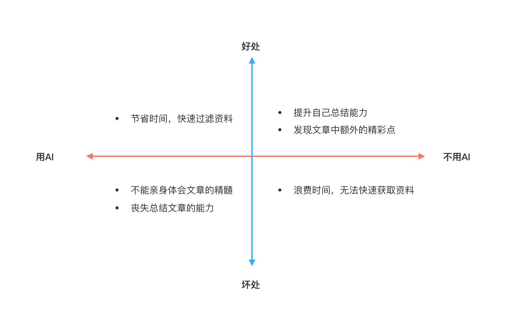

## 思考

大模型异军突起，很多以前实现起来很困难的功能在大模型前面变的轻而易举，「总结」能力就是其中一种。在我用的起劲的时候，突然反思，我这样做对吗？会不会让我自己丧失总结的能力？会不会失去阅读的兴趣？

画了个波士顿矩阵：

想了想，工具是帮助自己的，人类发明了计算器我能怕丧失计算能力而不用吗？君子爱器，取之有道，只要把握好一个度就好了。用ai总结的目的是帮自己快速过滤没有意义的文章，剩下的文章是需要自己认真研读的。

所以可以这么做：让ai总结，并问一些问题，比如文中是否有不合直觉的地方等等然后再决定是否详读。

## 资源

整理一下当前可以用的ai总结工具

-  [kimi](https://kimi.moonshot.cn/) ：个人觉得最好用
- [kagi](https://kagi.com/summarizer/index.html)：内容多，但没有重点
- [sider](https://chromewebstore.google.com/detail/sider-chatgpt%E4%BE%A7%E8%BE%B9%E6%A0%8F+-vision/difoiogjjojoaoomphldepapgpbgkhkb?pli=1)：浏览器扩展，需要选中文本再操作
- poe.com 内置的ai agent，比如：Summarise，URLsummary，Webpage等等
