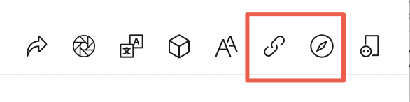
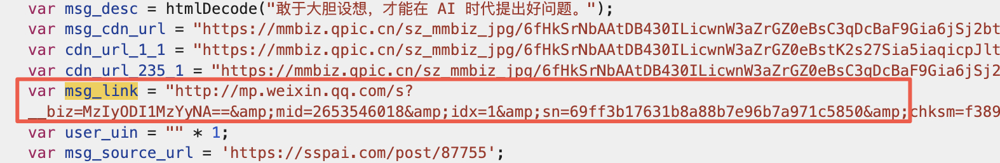

## 背景

一直以来对微信公众号文章的链接比较疑惑有时候很短，有时候很长，有时候保存的文章链接还会失效。

最近在看github 上的[etrobot/chatgptSummary](https://github.com/etrobot/chatgptSummary "etrobot/chatgptSummary") 里面有对链接的解析。自己试了下发现有些问题。所以借此机会搞清楚微信文章链接的一些概念

## 三种链接形式

### **短链接**

> [https://mp.weixin.qq.com/s/LmWJGCLyddA9sAM7arYpag](https://mp.weixin.qq.com/s/LmWJGCLyddA9sAM7arYpag "https://mp.weixin.qq.com/s/LmWJGCLyddA9sAM7arYpag")

由微信客户端生成，长度较短，链接的值或许为某种变种的base64，其长度恒定为22个字符。其中不带有可用与追踪用户身份的参数。只能通过微信客户端的「复制链接」或「在浏览器打开」功能获取这种链接。

### **完整链接**

> <https://mp.weixin.qq.com/s?__biz=MzIyODI1MzYyNA==&mid=2653546018&idx=1&sn=69ff3b17631b8a88b7e96b7a971c5850>

这是最常见的公众号文章链接格式，通常在浏览器中打开文章时可以看到(指手机客户端，在mac 客户端用浏览器打开是短链接)。

公众号文章会设置一个全局的JavaScript变量msg\_link，它的值就是完整链接格式的文章URL。这个变量可直接在文章的HTML代码中找到。（使用时需要对其进行HTML entity decode，将`&amp;`替换为`&`）

几个参数的含义：

- \_\_biz可以认为是微信公众平台对外公布的公众帐号的唯一id
- mid是图文消息id
- idx是发布的第几条消息(1就代表是头条位置消息)
- sn是一个随机加密串(对于一篇图文消息是唯一的)

### 临时链接

> [https://mp.weixin.qq.com/s?src=11\&timestamp=1712886908\&ver=5195\&signature=0M-muFRrcH94BrNld9FV6XZyD4uU503p-4G31bXv2Kum2toGDV9VMfHjuJhOc8gJwQ96kwenaMX1QKfs51js8rHRkbBJlM2gBCOke59WFxT9WodpTV8KDo4OPshf8YW1\&new=1](https://mp.weixin.qq.com/s?src=11\&timestamp=1712886908\&ver=5195\&signature=0M-muFRrcH94BrNld9FV6XZyD4uU503p-4G31bXv2Kum2toGDV9VMfHjuJhOc8gJwQ96kwenaMX1QKfs51js8rHRkbBJlM2gBCOke59WFxT9WodpTV8KDo4OPshf8YW1\&new=1 "https://mp.weixin.qq.com/s?src=11\&timestamp=1712886908\&ver=5195\&signature=0M-muFRrcH94BrNld9FV6XZyD4uU503p-4G31bXv2Kum2toGDV9VMfHjuJhOc8gJwQ96kwenaMX1QKfs51js8rHRkbBJlM2gBCOke59WFxT9WodpTV8KDo4OPshf8YW1\&new=1")

使用搜狗的微信搜索得到的链接。有效期应为6小时，到期后只能通过微信客户端才能查看。

`src`，显然指”source”。目前发现的值有3和11两种，含义未知。
`timestamp`，生成这个链接时的UNIX Timestamp，在服务器返回查询结果时便已确定，即按下搜索键或翻页的时刻。
`ver`，显然指”version”。可能是生成下面`signature`使用的算法版本，每个数字会使用一段时间，可能不超过一天。
`signature`，某种签名。长度恒定为128个字符，其中带有星号。

## 参考

- [微信公众号文章URL的种类与结构 | 咸湖的盐鱼](https://soaked.in/2020/08/wechat-platform-url/ "微信公众号文章URL的种类与结构 | 咸湖的盐鱼")
- [秘塔AI搜索](https://metaso.cn/search/8467529550246350848 "秘塔AI搜索")(微信公众号链接中 \_\_biz，mid，idx，sn 四个参数的意义)
- [解读微信公众平台图文消息的链接组成 - 菲比寻常 - 博客园](https://www.cnblogs.com/ckf1988/p/5653555.html "解读微信公众平台图文消息的链接组成 - 菲比寻常 - 博客园")
