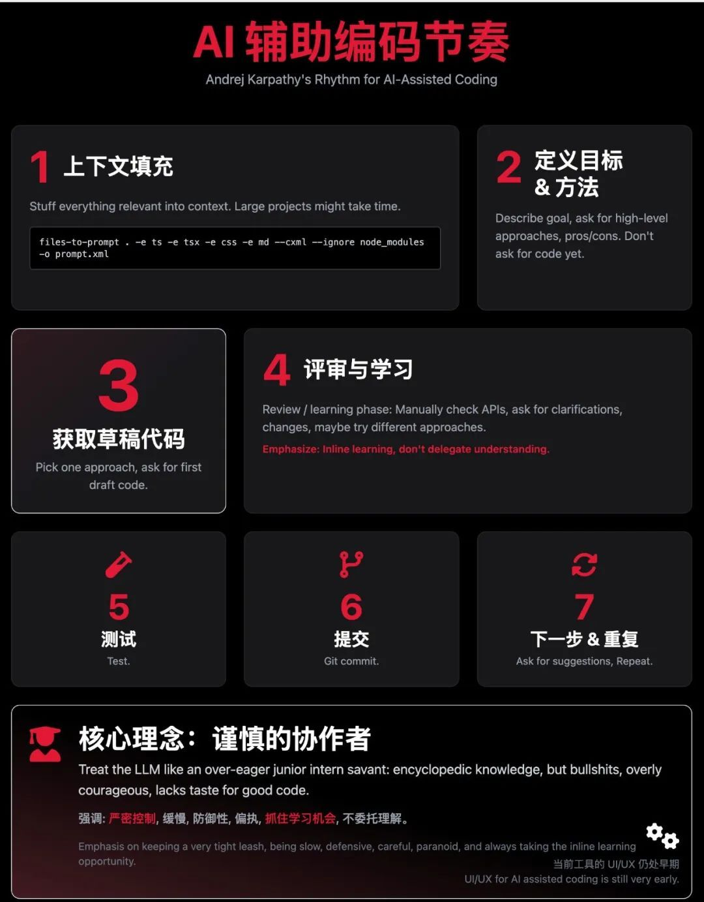
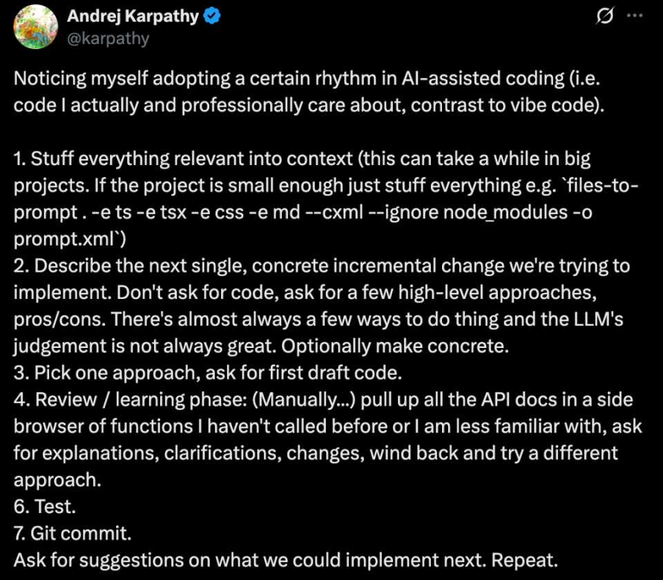

> Karpathy 的 AI 辅助编程心法，总结下来有七个关键步骤

**第一步：上下文拉满 (Stuff everything relevant into context)**

这是基础。你需要把项目所有相关的信息都喂给 AI。对于大型项目，这可能需要花些时间。如果是小项目，可以直接打包所有相关文件。Karpathy 甚至给出了一个 `files-to-prompt` 工具的示例命令：
`files-to-prompt . -e ts -e tsx -e css -e md --cxml --ignore node_modules -o prompt.xml`
这个命令大致意思是，将当前目录下所有的 `.ts`, `.tsx`, `.css`, `.md` 文件内容（忽略 `node_modules` 文件夹）打包成一个 XML 格式的 prompt 文件，供 AI 读取。核心思想是：给 AI 足够的全貌信息。

**第二步：策略先行，而非代码 (Describe the next single, concrete incremental change)**

明确你想要实现的下一个具体、增量的改动是什么。关键点来了：不要直接让 AI 写代码。相反，你应该要求 AI 提出几种实现该目标的高级方法，并分析各自的优缺点（pros/cons）。Karpathy 指出，LLM 的判断力并非总是最佳，通常实现一个功能有好几种方式，先看选项再决定。如果需要，可以再让 AI 把选定的方法具体化

**第三步：选定方案，获取初稿 (Pick one approach, ask for first draft code)**

从上一步 AI 提供的几种方法中，选择你认为最合适的一种。然后，才让 AI 基于这个选定的方法，生成第一版代码草稿

**第四步：评审与学习（关键环节） (Review / learning phase)**

这是 Karpathy 流程中的核心，也是体现“不复制代码”的关键。你需要**手动地**：

- • 在旁边打开浏览器，查阅代码中你不熟悉或新调用的 API 的官方文档。
- • 向 AI 提问，要求它解释代码、澄清疑点、进行修改。
- • 如果发现当前方法有问题或不够好，要勇于回溯（wind back），尝试之前讨论过的其他方法。
  这个阶段，重点是**开发者自己主动学习和理解**，而不是把思考完全外包给 AI。

**第五步：测试验证 (Test)**

对 AI 生成或修改后的代码进行严格的测试。确保它能按预期工作，并且没有引入新的问题。

**第六步：代码提交 (Git commit)**

测试通过后，将代码提交到版本控制系统（如 Git）。这是一个标准的开发实践，确保工作的成果被记录和保存。

**第七步：规划下一步，循环往复 (Ask for suggestions on what we could implement next. Repeat.)**

完成一个增量改动后，可以询问 AI 对于“接下来可以实现什么功能”的建议。然后，基于这些建议或你自己的规划，开始新一轮的循环，回到第一步或第二步。

---

Andrej Karpathy的原文：https://x.com/karpathy/status/1915581920022585597

